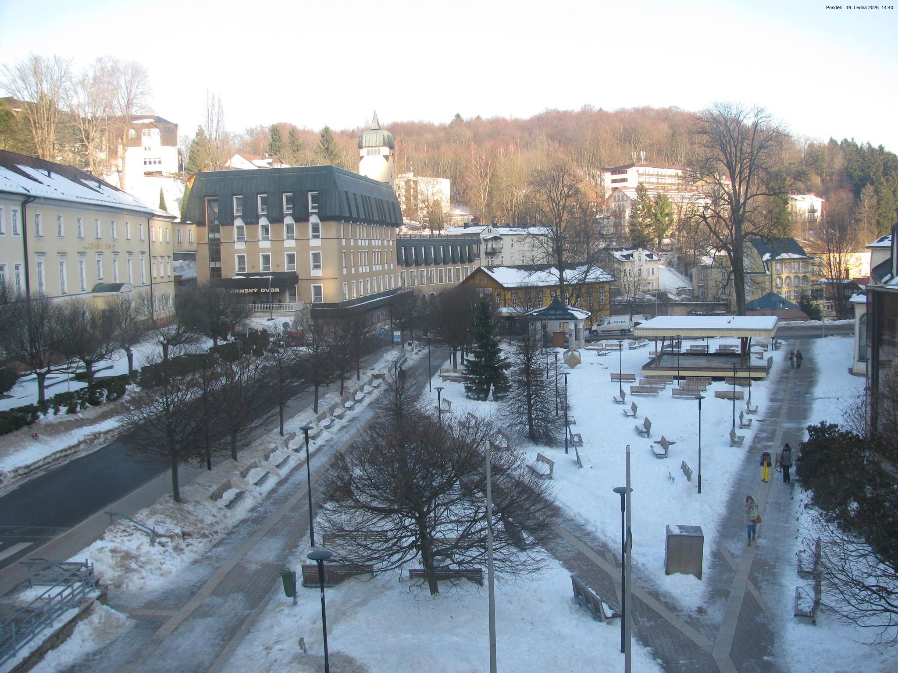
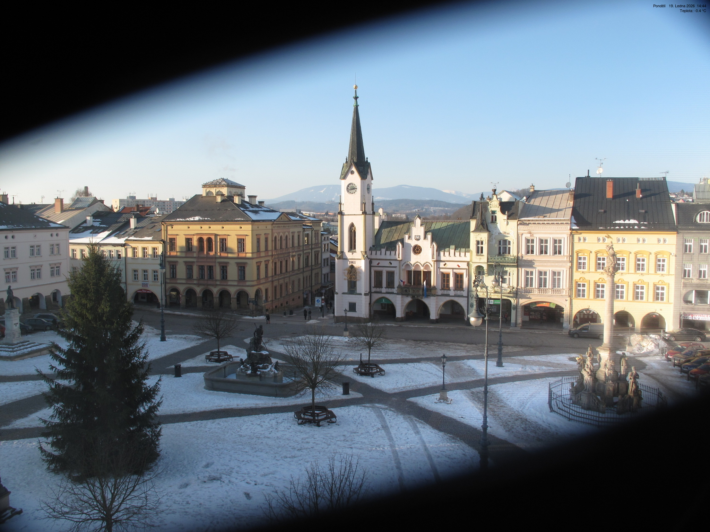
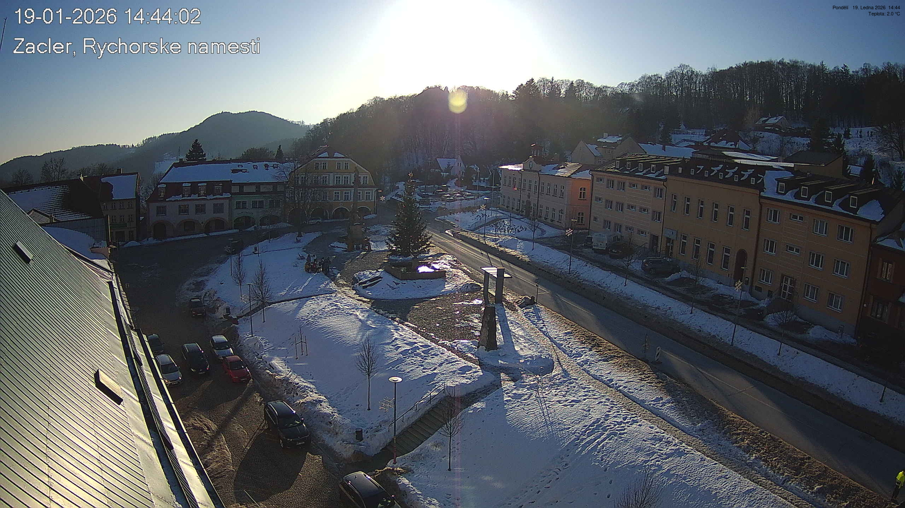

# WebCamWallpaper

Программа для автоматической смены обоев рабочего стола с использованием изображения с веб-камеры.  

Проект написан на **Python** и позволяет:  
- захватывать изображение с веб-камеры  
- сохранять его локально  
- устанавливать как обои рабочего стола через заданный интервал времени  

Идеально подходит для демонстрации навыков работы с Python, веб-камерой и автоматизации на Windows.

---

## 📸 Скриншоты


  
  


---

## ⚙️ Требования

- Python 3.10+  
- Windows 10/11 (или другая ОС с поддержкой смены обоев через Python)  
- Библиотеки Python (установить через `pip`):

```bash
pip install opencv-python pillow pywin32

